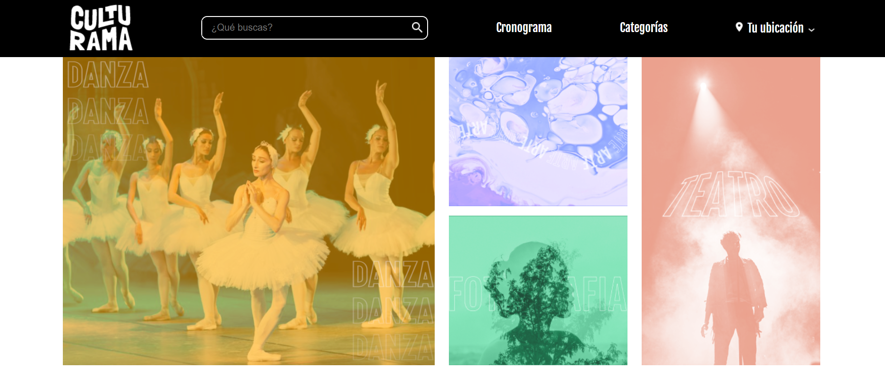

#  Culturama 

Culturama es una web de promoción de eventos culturales, creada especialmente para este curso, aquí puedes acceder al [figma](https://www.figma.com/design/Qc5ioFIDbc2fpoyKwkLhQG/Practicando-CSS%3A-Grid-y-Flexbox?node-id=79-289&t=AvzAEOoQlubQYKdM-0) del proyecto.

## ✔️ Técnicas y tecnologías utilizadas.

- `HTML`: juega un papel fundamental en la creación de las estructuras de las páginas que componen el proyecto Culturama.
- `CSS`: juega un papel fundamental en la creación de los estilos que dan vida al proyecto y también en la construcción de la organización y disposición de los elementos de la página con **Flexbox** y **Grid**. Algunas propiedades que fueron cubiertas:
  - `display: flex`;
  - `flex-direction`;
  - `flex-wrap`;
  - `flex-grow`;
  - `order`;
  - `display: grid`;
  - `grid-column` y `grid-row`;
  - `grid-area`;
  - `grid-template-areas`;
  - `grid-template-columns`;
  - `column-gap`, `gap` y `row-gap`;
  - `align` y `justify`;
 
  
En este repositorio tienes acceso a todo el material producido en el curso.

## 🛠️ Abrir y ejecutar el proyecto

Para abrir y ejecutar el proyecto, simplemente abra el archivo `index.html` en el navegador.